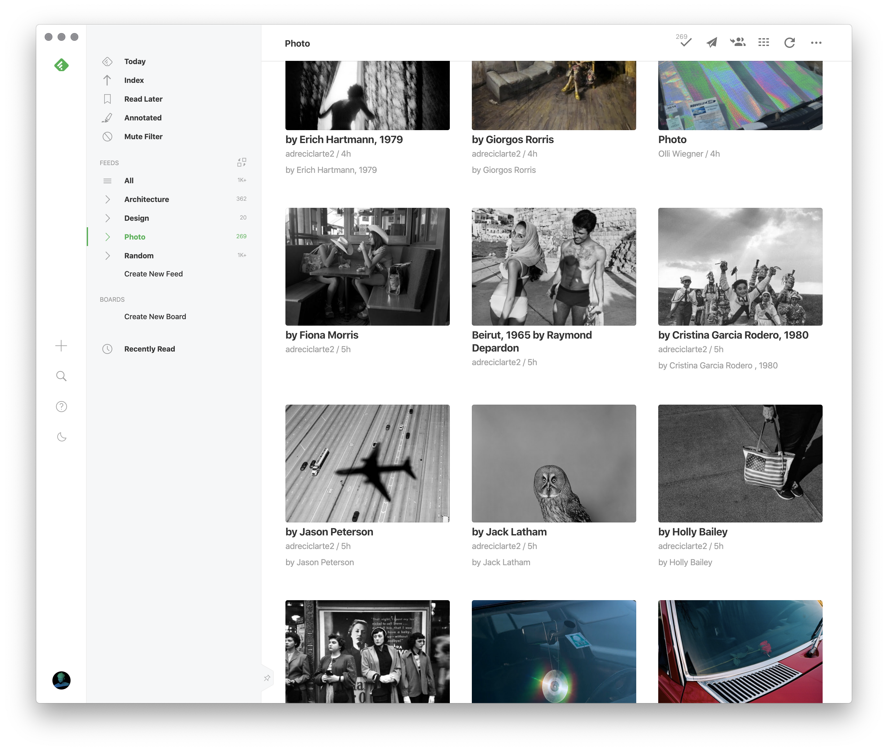

# Feedly app

A basic [electron](http://electron.atom.io) app so [feedly](feedly.com) looks
just how I like it

## Features

- Decent icon with unread badge
- External links open in default browser in the background

## Download

[Feedly for macOS](https://github.com/chrstphrknwtn/feedly-app/releases/download/v0.0.3/Feedly_macOS.dmg)
